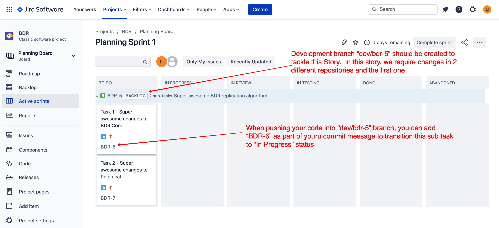

# Product development

## Versioning approaches

[Semantic versioning](https://semver.org/)

## Ways of working

The team adopts lean and devops methodologies, with peer reviews and a
multiple review workflow process. Kanban is used by the team to define
the tempo of development, with a prioritized backlog in Jira. Bi-weekly
sprint review meetings are held to provide status updates and determine
next goals.

## Development workflow

The workflow is based on the [*Github
Flow*](https://guides.github.com/introduction/flow/), with some
customizations:

- the Continuous Delivery branch is called "main" and is protected
- Github is configured for linear development (no merge commits)
- Development happens in separate branches created from the "main" branch and called "*dev/TICKET_ID*".  `TICKET_ID` in this case is the ticket id of a `Story` or `Task`, never a `Sub-task`.  This approach allows our CI process to use the branch name to group commits associated with the same feature.
- Developers will only work with `Sub-tasks` which are pieces of work that need to be completed in order to complete their parent (`Story` or `Task`) ticket. 
- If you want to automatically transition your `Sub-task` in Jira to the `In progress` status when starting development, simply include the `ticket number` anywhere in your commit message (e.g. "fixing segmentation fault for BDR-123") and the `Jira sync` Git action will handle the transition for you.
- When development is completed for a `Sub-task`, developer must submit a pull request and mention the **`Sub-task` `ticket number` any where in the title of the pull request** and the Github action `Jira sync` will parse the PR title to transition your ticket to `In Review` status in JIRa when you request a reviewr for your PR. 
- The pull request will need to pass a set of preliminary automated tests and reviewed by a designated principal BDR developer before merging into `main`.

### Example:
Syncing `Sub-task` status in JIRA Example:

## Meetings

- Sprint kickoff
- Sprint review
- Sprint retro via web app
- Daily catch up via Slack

## Chats

Private chats: 

- [#eng-bdr-dev](https://edb.slack.com/archives/G01FLQYF0H1) - our private development channel

## Jira projects

- [*BDR (Bi-directional Replication)*](https://enterprisedb.atlassian.net/browse/bdr)

## Confluence space

- [*BDR Space*](https://enterprisedb.atlassian.net/wiki/spaces/BDR/overview?homepageId=1876590888)

